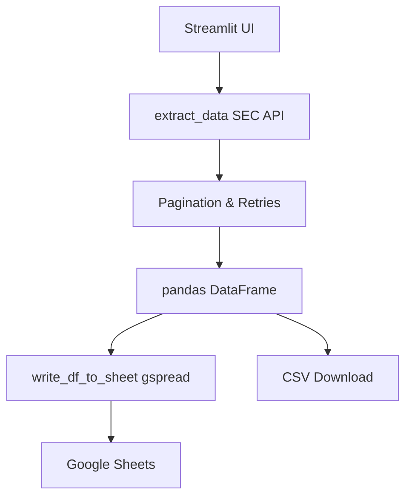

## Overview

The SEC Filings Scraper is a Streamlit-based application that lets you fetch SEC filings using the official SEC API at `https://efts.sec.gov/LATEST/search-index`. You can apply advanced filters like keywords, company names, tickers, CIK numbers, date ranges, and filing types. Results export directly to Google Sheets or as CSV downloads, making it ideal for analysis and tracking.

This tool handles pagination automatically (100 results per page), includes retry logic for reliability, and manages Google Sheets headers intelligently—writing them only on the first export to avoid duplication.

<Callout kind="info">
  Perfect for researchers, analysts, and compliance teams tracking 10-Ks, 8-Ks, DEF 14A proxy statements, 13D/G ownership changes, and more.
</Callout>

## Key Features

<Columns cols={3}>
  <Card title="Advanced Search Filters" icon="search" href="#search-examples">
    Filter by document keywords, company/ticker/CIK, date ranges, and predefined filing groups like Riskalert-General or DEF14.
  </Card>
  <Card title="Google Sheets Integration" icon="file-text" href="#sheets-setup">
    Append results to worksheets with automatic header detection and A1-range writes to prevent column drift.
  </Card>
  <Card title="Reliable Data Fetching" icon="shield" href="#architecture">
    Pagination, exponential backoff retries, and session-level error handling for consistent results.
  </Card>
</Columns>

## Architecture

The app consists of three core components: data fetching via the SEC API, sheet writing with gspread, and a Streamlit UI for configuration.



<Expandable title="Detailed Component Breakdown" default-open="false">

### Data Fetching (`extract_data`)
Queries the SEC endpoint with parameters like `q` (keywords), `startdt`/`enddt` (dates), `forms` (types), and `entityName` (company/CIK).

**Key Response Fields:**
- `form`: Filing type (e.g., `10-K`)
- `filed`: Filing date
- `url`: Direct document link
- `symbol`: Ticker
- `cik`: Central Index Key

### Sheet Writing (`write_df_to_sheet`)
- Checks if row 1 is empty; writes headers only then.
- Appends data rows starting at A2 (empty) or next available row.
- Uses explicit A1 notations for column stability.

</Expandable>

## Prerequisites

Before setup, ensure you have:

- Python 3.8+
- Google Cloud project with Sheets API enabled
- Service account JSON key (share your Sheet with the `client_email`)
- A shared Google Sheet

<Callout kind="tip">
  Create a service account at Google Cloud Console, download the JSON, and add the service account email as an editor to your Sheet.
</Callout>

## Quick Start

Follow these steps to get running in minutes.

<Steps>
  <Step title="Install Dependencies" icon="download">
    <CodeGroup tabs="pip">
      ```bash
      pip install streamlit gspread google-auth requests pandas
      ```
    </CodeGroup>
  </Step>
  <Step title="Prepare Credentials" icon="key">
    Upload your service account JSON and paste the Google Sheets URL in the Streamlit sidebar.
  </Step>
  <Step title="Run the App" icon="play">
    ```bash
    streamlit run app.py
    ```
  </Step>
  <Step title="Test Connection" icon="link">
    Click "🔗 Test Spreadsheet Connection" and select a worksheet.
  </Step>
</Steps>

## Example Searches

<Tabs>
  <Tab title="Recent 10-Ks" icon="file-text">
    - Date Range: Last 30 days
    - Filing Types: `10-K`
    - Click "🔎 Fetch Filings"
  </Tab>
  <Tab title="Acquisitions by AAPL" icon="search">
    - Document Search: `acquisition`
    - Company/Ticker/CIK: `AAPL`
    - Filing Types: `8-K,10-Q`
  </Tab>
  <Tab title="Proxy Statements" icon="users">
    - Filing Types: `DEF 14A` or "Riskalert-DEF14"
  </Tab>
</Tabs>

<Callout kind="success">
  Ready to dive deeper? Explore [setup details](#), [usage guide](/quickstart), or [API reference](/authentication) next.
</Callout>