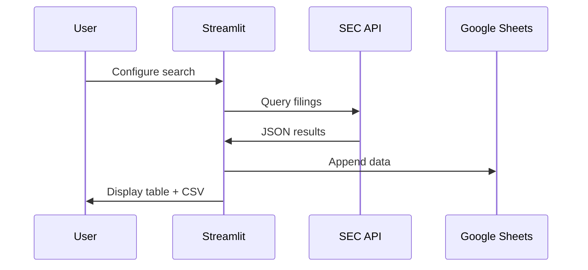

## Prerequisites

<Callout kind="info">
Before starting, ensure you have:
- Python 3.8 or higher installed
- A Google Cloud project with the Sheets API enabled
- Access to a Google Sheet you'll share with a service account
- Basic familiarity with the command line
</Callout>

## Install Dependencies

Follow these steps to set up the project locally.

<Steps>
  <Step title="Clone the Project" icon="download">
    Download or clone the SEC Filings Scraper repository to your local machine.

    ```
    git clone https://github.com/your-repo/sec-filings-scraper.git
    cd sec-filings-scraper
    ```
  </Step>

  <Step title="Install Python Packages" icon="package">
    Install the required dependencies using pip.

    <CodeGroup tabs="pip,requirements">
      ```bash
      pip install streamlit gspread google-auth requests pandas
      ```

      ```bash
      pip install -r requirements.txt
      ```
    </CodeGroup>
  </Step>
</Steps>

## Set Up Google Sheets Credentials

You need a Google service account to write results to Sheets.

<Steps>
  <Step title="Create Service Account" icon="settings">
    1. Go to the [Google Cloud Console](https://console.cloud.google.com/).
    2. Create a new project or select an existing one.
    3. Enable the Google Sheets API.
    4. Navigate to IAM & Admin > Service Accounts.
    5. Create a service account and download the JSON key file.
  </Step>

  <Step title="Share Your Sheet" icon="users">
    1. Open your target Google Sheet.
    2. Share it with the service account email (found in the JSON file as `client_email`).
    3. Note the Spreadsheet ID from the URL: `https://docs.google.com/spreadsheets/d/SPREADSHEET_ID/edit`.
  </Step>
</Steps>

<Callout kind="tip">
Keep the service account JSON file secure. You'll upload it directly in the Streamlit app—no environment variables needed.
</Callout>

## Launch the App

Run the Streamlit application to access the UI.

```
streamlit run app.py
```

The app opens at `http://localhost:8501`. Use the sidebar to configure searches.

## Perform Your First Search

<Tabs>
  <Tab title="Connect to Sheets" icon="database">
    <Steps>
      <Step title="Upload Credentials">
        In the sidebar, upload your service account JSON file.
      </Step>

      <Step title="Test Connection">
        Paste your Spreadsheet URL, click **🔗 Test Spreadsheet Connection**, then select a worksheet.
      </Step>
    </Steps>
  </Tab>

  <Tab title="Fetch Filings" icon="search">
    <Steps>
      <Step title="Enter Parameters">
        - Document keyword: `acquisition` (optional)
        - Company/Ticker/CIK: `AAPL`
        - Date range: Last 30 days
        - Filing types: Check `10-K`
      </Step>

      <Step title="Run Search">
        Click **🔎 Fetch Filings**. Results appear in the main table.
      </Step>

      <Step title="Export">
        Data auto-appends to your sheet. Download CSV if needed.
      </Step>
    </Steps>
  </Tab>
</Tabs>

## Example Results Table

Your fetched data includes key fields like this:

| Form | Filed     | Company     | Symbol | CIK     | URL                          |
|------|-----------|-------------|--------|---------|------------------------------|
| 10-K | 2024-01-15 | Apple Inc. | AAPL   | 0000320193 | https://www.sec.gov/Archives... |

## Next Steps

<Columns cols={3}>
  <Card title="Advanced Searches" icon="search" href="/guide">
    Explore predefined filing groups like DEF14A or 13D.
  </Card>

  <Card title="API Details" icon="code" href="/api-reference">
    Understand SEC API parameters and pagination.
  </Card>

  <Card title="Troubleshooting" icon="help-circle" href="/faq">
    Fix common issues like rate limits or sheet permissions.
  </Card>
</Columns>

